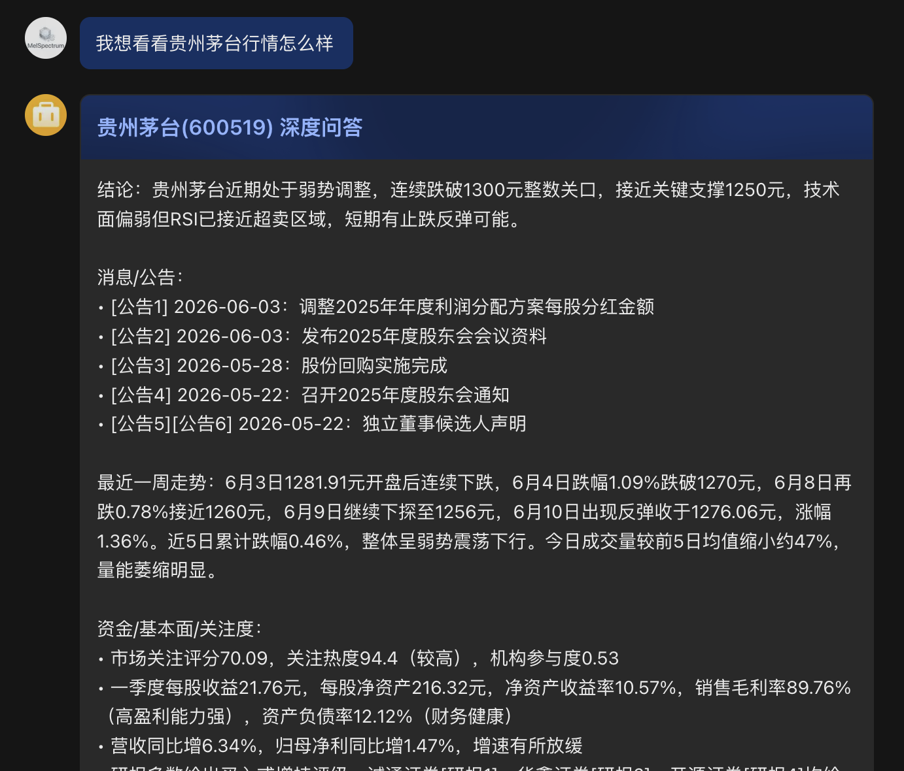
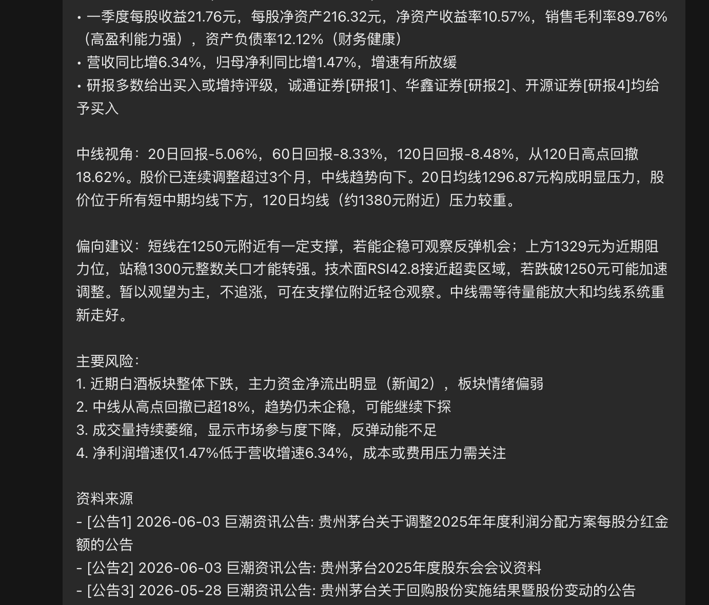

# StockWatch — 帮家人少盯盘的 A 股提醒机器人

> 一个可以跑在树莓派、NAS、macOS 或 Linux 服务器上的 A 股家庭盯盘助手：自动看自选股、持仓风险、盯价、公告新闻和盘面异动，只在值得看的时候通过 Web 控制台或飞书提醒。

[](https://www.python.org/)
[](https://github.com/microsoft/LightGBM)
[](https://github.com/akfamily/akshare)
[](https://github.com/larksuite/oapi-sdk-python)
[](LICENSE)

中文 | [English](#english)

**关键词**：A股盯盘提醒、家庭盯盘助手、少盯盘、股票机器人、飞书机器人、A股新闻分析、股票公告解读、LightGBM 排序模型、Alpha158 因子、AKShare、macOS/Linux 部署、树莓派 24h 服务。

StockWatch 不是自动交易工具，也不是荐股软件。它更像一个给家人用的 A 股提醒机器人：你把自选股、买入价和盯价告诉它，它会定时分析行情、公告、新闻、资金流、技术面和持仓风险；如果跌破止损、接近目标价、出现重大消息或盘面异动，再通过飞书提醒你去看。目标是把“持续盯盘”变成“事件提醒”，减少无意义刷屏和情绪消耗。

你也可以像和 AI 聊天一样问它“贵州茅台最近怎么样”“现在行情怎么样”，它会尽量引用公告、新闻、资金流、财务和走势数据回答。

> 仅供学习、研究和家庭辅助决策使用，不构成任何投资建议。

## 合规边界

StockWatch 的定位是**自选股盯盘提醒、公开信息聚合和持仓风险复核工具**，不是证券投资咨询服务、不是荐股软件，也不提供确定性的买入、卖出或收益承诺。

- 系统只围绕用户自己添加的自选股、持仓成本和关键价做提醒。
- “机会观察”“风险复核”等提示只表示值得用户进一步查看，不代表买卖指令。
- Web 控制台生成的“风险价”“观察压力位”只是用户自选提醒线，不代表止盈止损建议、买卖指令或收益承诺。
- 公告、新闻、行情、模型分析和复盘结果都可能延迟、遗漏或出错，使用者应自行核验交易所公告、上市公司披露、券商行情和其他权威来源。
- 如果基于本项目提供云端托管、通知、数据同步或其他付费服务，请避免以“荐股”“带单”“收益保证”等方式宣传，并自行确认所在地证券投资咨询、数据授权和广告合规要求。

---

## 功能亮点

- **A股盯盘推送**：按早盘前、午间、收盘后自动运行，非交易日跳过。
- **安心模式**：没有必须看的风险时，收盘后可以推送“今日不用盯盘”总结。
- **异动提醒分级**：用户可用 `ALERT_LEVELS` 选择只看必须看/建议看/普通提醒。
- **家庭版一句话**：可开启 `ENABLE_FAMILY_BRIEF`，用少术语的话告诉家人“今天要不要看”。
- **Web AI 控制台 / 手机 PWA**：网页里直接问行情、查个股、生成参考风险线/观察压力位、开始/停止持仓跟踪、设置/取消盯价，可添加到手机主屏幕使用。
- **飞书自然语言问答**：支持股票代码、股票名称、买入跟踪、盯价、取消盯价，也支持“现在行情怎么样”这类自然输入。
- **深度问答**：可回答“600449 最近一周走势如何”“宁夏建材重组怎么样”“我想看看贵州茅台行情怎么样”等问题，并优先引用公告/新闻来源。
- **消息面分析**：抓取近况新闻、公司公告、研报、资金流、财务快照和市场关注信息，交给模型生成可读建议。
- **量化因子**：计算扩展版 Alpha158/Alpha300 风格因子，覆盖动量、波动、Beta、流动性冲击、相对强弱、回撤和成交量结构。
- **LightGBM 排序模型**：离线训练 A 股横截面排序模型，线上作为辅助信号参与解释。
- **关联补涨观察**：可识别当日领涨股，并从本地历史库中扩展历史 1 日滞后相关的候选股，生成“可能未充分反应”的传播特征。
- **本地 Web 控制台**：展示最近运行、提醒卡片、持仓跟踪、盯价提醒和 5 日信号复盘，也能配置模型、渠道、远程访问、开关和个性化。
- **因子市场**：像插件市场一样筛选内置/本地上传因子，查看分类、周期、说明和数据要求，自行搭配参与分析的内置因子。
- **反馈飞轮入口**：每条提醒可标记“有用/误报/看不懂”，本地记录后用于复盘提醒质量。
- **信号复盘报告**：基于本地 SQLite 中的历史决策和 K 线生成命中率/窗口收益报告。
- **macOS/Linux 部署**：systemd/命令行常驻服务 + SQLite 本地存储；作者使用树莓派 5 低成本 24 小时运行。
- **Docker Compose 部署**：可用容器跑定时盯盘、Dashboard 和可选飞书机器人。

更多可直接复制的宣传文案见 [docs/promotion.md](docs/promotion.md)。

---

## 实测效果

自然语言提问示例：`我想看看贵州茅台行情怎么样`。机器人会返回结论、公告/新闻、最近走势、资金/基本面/关注度、中线视角、偏向建议、主要风险和资料来源。





---

## 快速开始

### 0. 一键启动（推荐普通用户）

不熟悉命令行？下载仓库后直接运行：

| 系统 | 命令 |
|------|------|
| macOS / Linux | `bash start.sh` |
| Windows | 双击 `start.bat` |

脚本自动完成：创建虚拟环境 → 安装依赖 → 检查配置 → 启动 Web 控制台。

**首次运行流程：**

1. 脚本发现没有 `.env`，自动复制示例并用编辑器打开
2. 填写 4 个必填项（自选股 + AI 模型配置），其他保持默认
3. 保存后重新运行 `bash start.sh`，浏览器自动打开控制台
4. 在控制台里按"开始使用"向导完成剩余设置（约5步，10分钟）

**没有 API Key？用免费本地模型：**

```bash
# 1. 安装 Ollama（https://ollama.com）
curl -fsSL https://ollama.com/install.sh | sh   # macOS/Linux
# Windows：去 https://ollama.com/download 下载安装包

# 2. 拉取模型（首次约需几分钟，4GB下载量）
ollama pull qwen2.5:7b

# 3. 在 .env 中填入（无需 API Key）
# LLM_PROVIDER=openai
# LLM_BASE_URL=http://127.0.0.1:11434/v1
# LLM_MODEL=qwen2.5:7b
# LLM_API_KEY=
```

---

### 打开 Web 控制台

Web 控制台是不需要飞书的全功能入口——可以查股票、设盯价、看提醒历史、配置参数。

```bash
# 激活虚拟环境（首次安装后）
source .venv/bin/activate   # macOS/Linux
# .venv\Scripts\activate     # Windows

# 启动控制台
python main.py dashboard
```

浏览器访问 **http://127.0.0.1:8765**（或按终端提示的地址）。

**手机访问（局域网）：**

```bash
# 先设置访问密码（防止局域网其他设备进入）
# 在 .env 中添加：WEB_AUTH_TOKEN=你的密码

python main.py dashboard --host 0.0.0.0
# 然后用手机浏览器访问 http://电脑局域网IP:8765
```

可添加到手机主屏幕作为 PWA 使用。

---

### 1. 5 分钟体验（无需飞书）

先跑一个终端 demo。没有 LLM API Key 时会降级输出规则化行情快照；配置任意支持的模型后会输出完整自然语言问答。

```bash
# 克隆本仓库后进入项目目录
cd StockWatch
python -m venv .venv
source .venv/bin/activate
pip install -r requirements.txt

# 个股自然语言问答
python main.py demo "600519 最近一周走势如何"

# 大盘/行情问答
python main.py demo "现在行情怎么样"
```

### 2. 配置凭证

```bash
cp .env.example .env
nano .env
```

必填项：
- `LLM_API_KEY` — 模型服务 API Key；本地 OpenAI-compatible 服务通常可留空
- `FEISHU_APP_ID` / `FEISHU_APP_SECRET` — 飞书自建应用凭证
- `FEISHU_RECEIVE_ID` — 接收人 open_id/user_id/email

### 3. 配置模型

StockWatch 不绑定某一家模型。你可以使用 MiniMax、OpenAI、DeepSeek、通义千问兼容接口、硅基流动、OpenRouter 等 OpenAI-compatible 服务，也可以使用 Anthropic，或接入本地部署的 Ollama/vLLM/LM Studio 来节约成本。不同模型的区别主要体现在生成质量、速度、上下文能力和费用。

OpenAI-compatible 示例：

```bash
LLM_PROVIDER=openai
LLM_API_KEY=sk-xxxx
LLM_BASE_URL=https://api.example.com/v1
LLM_MODEL=your-model-name
AI_RESPONSE_STYLE=balanced
```

Anthropic 示例：

```bash
LLM_PROVIDER=anthropic
LLM_API_KEY=sk-ant-xxxx
LLM_MODEL=claude-3-5-sonnet-latest
```

本地模型示例：

```bash
LLM_PROVIDER=openai
LLM_BASE_URL=http://127.0.0.1:11434/v1
LLM_MODEL=qwen2.5:7b
LLM_API_KEY=
```

旧版 `MINIMAX_API_KEY` / `MINIMAX_BASE_URL` / `MINIMAX_MODEL` 仍兼容；如果同时配置了 `LLM_*`，优先使用 `LLM_*`。

### 4. 修改自选股

```bash
# 编辑 .env 中的 WATCHLIST（逗号分隔代码）
WATCHLIST=600519,000858,510300,510500,159915
# 格式：6位股票代码，ETF同理（159915=创业板ETF）
# 保存后重启服务：systemctl restart stockwatch
```

### 5. 少盯盘提醒偏好

```bash
# critical=必须看，warning=建议看，info=普通提醒/仅记录
ALERT_LEVELS=critical,warning,info

# 安心模式：没有重大风险时，收盘后发“今日不用盯盘”
ENABLE_REASSURANCE_MODE=true
ENABLE_AFTER_CLOSE_SUMMARY=true

# 家庭版一句话：少术语，直接告诉家人今天要不要看
ENABLE_FAMILY_BRIEF=true
```

如果只想看红色/橙色提醒，可以设成：

```bash
ALERT_LEVELS=critical,warning
```

### 6. 运行模式

```bash
source .venv/bin/activate

# 自检（AKShare / LLM / 飞书）
python main.py test

# 立即运行一次完整流程
python main.py once

# 守护进程模式（按调度自动运行）
systemctl start stockwatch
systemctl status stockwatch

# 飞书交互式查询机器人（SDK 长连接）
python main.py bot

# 本地 Web 控制台
python main.py dashboard

# 生成信号复盘报告
python main.py report --horizon 5 --output reports/backtest.md
```

### 7. Docker Compose

```bash
cp .env.example .env
nano .env

# 定时盯盘 + Dashboard
docker compose up -d stockwatch dashboard

# 可选：启用飞书长连接机器人
docker compose --profile bot up -d

# 查看 Dashboard
open http://127.0.0.1:8765
```

容器数据会写入 `stockwatch-data` volume，对应程序内的 `/root/.stockwatch`。

---

## 日志

```bash
# 实时日志
tail -f ~/.stockwatch/logs/stockwatch_$(date +%Y%m%d).log

# 7天保留，滚动删除
~/.stockwatch/logs/
```

---

## 数据库

```bash
# 查看 SQLite 数据
sqlite3 ~/.stockwatch/db.sqlite

# 查看最近运行记录
sqlite3 ~/.stockwatch/db.sqlite "SELECT * FROM runs ORDER BY run_ts DESC LIMIT 5;"

# 查看推送记录
sqlite3 ~/.stockwatch/db.sqlite "SELECT run_id, code, name, action, confidence, pushed FROM decisions ORDER BY run_ts DESC LIMIT 20;"
```

---

## 本地 Web 控制台

```bash
python main.py dashboard
```

默认地址：`http://127.0.0.1:8765`。

Web 控制台直接读取本地 SQLite，并提供本地配置入口，可用于：

- 首页“开始使用”初始引导：添加自选股、配置模型、选择通知方式、设置打扰级别、添加持仓或关键价
- 手机 PWA：移动端底部导航、提醒卡片和可添加到手机主屏幕的 `manifest.json`
- 最近运行记录
- AI 控制台里直接提问、查股票、生成参考风险线/观察压力位、开始/停止持仓跟踪、设置/取消盯价；回答区会提取关键摘要和可一键执行的盯盘动作
- 最近提醒、置信度和“有用/误报/看不懂”反馈按钮
- 活跃持仓跟踪
- 活跃盯价提醒
- 5 日信号复盘摘要
- 自选股、模型接口/API Key、通知渠道、远程访问、功能开关、AI 回复风格和因子配置
- 因子市场：筛选内置/本地上传因子，查看类型、周期、介绍和数据要求
- 上传自定义因子文件，保存为本地因子库条目；为安全起见，上传的 Python 默认不自动执行
- 反馈入口：Web UI 导航和页面底部会链接到 [GitHub Issues](https://github.com/v0id-byte/stockwatch/issues)

保存配置会写入本地 `.env`；已运行的守护进程或飞书 Bot 通常需要重启后读取新配置。

第一次打开 Web 控制台时，建议按首页“开始使用”清单依次完成：先添加自选股，再配置模型和通知方式，然后设置提醒级别，最后添加真实持仓或关键价。这样系统会围绕你真正关心的股票提醒，而不是泛泛扫描。

AI 控制台里的“生成参考风险线”会根据用户输入的成本价，结合实时价、近 20 日支撑压力和 ATR 生成候选风险价与观察压力位。用户需要自行确认后再保存为向下/向上盯价提醒；这些价位只是提醒线，不是止盈止损建议、买卖指令或收益保证。

如果只想使用 Web 控制台，不接飞书，可以设置：

```bash
NOTIFY_CHANNEL=web
```

### 手机和远程访问

本机默认只监听 `127.0.0.1:8765`，适合在电脑上使用。手机和远程访问建议按安全层级选择：

```bash
# 1. 先设置 Web 访问 Token
WEB_AUTH_TOKEN=change-me

# 2. 局域网访问：手机和电脑在同一个 Wi-Fi 下
python main.py dashboard --host 0.0.0.0
```

- 局域网：设置 `WEB_AUTH_TOKEN` 后再监听 `0.0.0.0`，用 `http://电脑局域网IP:8765` 访问。
- 自用远程：推荐 Tailscale Serve，只允许自己的 tailnet 设备访问。
- 公开域名：推荐 Cloudflare Tunnel + Cloudflare Access，把 Web UI 放在身份验证后面。
- 临时演示：可以用 ngrok，但不要长期裸奔。
- 不要把未设置 `WEB_AUTH_TOKEN` 的 Web UI 暴露到公网；配置页里可能包含模型 Key、通知凭证和持仓成本。

飞书渠道仍然可用。创建飞书自建应用后，需要配置 `FEISHU_APP_ID`、`FEISHU_APP_SECRET`、`FEISHU_RECEIVE_ID`，并在飞书开放平台开通发送消息权限；如果要用飞书长连接机器人接收消息，还需要配置事件订阅和接收消息事件。

如果用 Docker：

```bash
docker compose up -d dashboard
```

---

## 信号复盘报告

```bash
# 统计信号后 5 个交易日表现，输出到终端
python main.py report --horizon 5

# 写入 Markdown 文件
python main.py report --horizon 5 --output reports/backtest.md
```

报告会基于本地 `decisions` 和 `daily_kline` 计算 BUY/SELL/HOLD 的样本数、命中率、平均窗口收益和中位窗口收益。命中率定义很朴素：BUY 后窗口收益为正、SELL 后窗口收益为负、HOLD 后窗口收益在 ±2% 内。

这只是事后研究复盘，不是收益承诺，也不会修改数据库。

---

## 少盯盘模式

这组能力围绕一个目标：不用一直坐在屏幕前看分时图，只在值得看的时候提醒。

- **安心模式**：开启 `ENABLE_REASSURANCE_MODE=true` 后，如果当天没有触发必须看的风险，收盘后会发“今日不用盯盘”总结。
- **休市后总结**：开启 `ENABLE_AFTER_CLOSE_SUMMARY=true` 后，15:00 后的收盘分析会尝试发送当天总结；同一天只发一次。
- **异动提醒分级**：`ALERT_LEVELS=critical,warning,info` 控制推送等级。只想看关键提醒时可设为 `critical,warning`。
- **家庭版一句话**：开启 `ENABLE_FAMILY_BRIEF=true` 后，飞书卡片会多一行少术语结论，例如“暂时没有必须操作的信号，不用一直盯盘”。

等级含义：

| 等级 | 含义 | 典型场景 |
| --- | --- | --- |
| `critical` | 必须看 | 跌破止损、强卖出风险、负面重大消息 |
| `warning` | 建议看 | 触发盯价但盘口卖压偏重、普通买/卖关注信号 |
| `info` | 普通提醒 | 普通触价、正面消息、持有观察 |

---

## 调度说明

每日自动运行时间（Asia/Shanghai）：
- **09:10** 早盘前：隔夜消息 + 当日策略
- **12:30** 午间：上午盘面回顾 + 下午建议
- **15:15** 收盘后：全天复盘 + 次日观察

非交易日（周末/节假日）自动跳过。

## 飞书交互式查询

开启 `stockwatch-bot` 后，可以在飞书里直接给机器人发消息：

```text
600519
现在行情怎么样
我想看看贵州茅台行情怎么样
600449 最近一周走势如何
买入 600519 1680
买入 600519 1680 100股
盯买 600519 1500
盯买 600519 1500 100股
取消盯价 600519
卖出 600519
停止跟踪 600519
```

`股票代码` 会即时回复单只股票分析；自然问句会走深度问答，识别到股票时优先回答个股，未识别到具体股票时会回答大盘/行情问题；`买入` 会写入持仓跟踪，后续定时盯盘会把这只股票加入分析池，触发止损、接近目标价或模型转为 SELL 时主动推送；`卖出` 会停止跟踪。

`盯买` 是兼容旧习惯的关键价提醒命令，会设置一个向下触发的观察价。盘中轻量监控每 5 分钟检查一次，触价时会结合五档盘口和内外盘判断卖压；如果卖压偏重，会提示先复核风险计划。系统也会每 30 分钟扫描自选股、持仓和盯价股的重大新闻，避免重复提醒。

---

## v2 升级路径

```bash
cd ~/stockwatch && source .venv/bin/activate

# 1. 拉取新代码后先做增量迁移（可重复执行）
python scripts/migrate_v2.py

# 2. 编辑 .env，按模块逐个开启
nano ~/stockwatch/.env

# 3. 先自检，再重启服务
python main.py test
systemctl restart stockwatch
```

v2 新增开关默认关闭：

```bash
ENABLE_CALIBRATION=false
CALIBRATION_LOOKBACK_DAYS=5
CALIBRATION_MIN_SAMPLES=50

ENABLE_ALPHA158=false

ENABLE_LGBM=false
LGBM_MODEL_PATH=~/.stockwatch/models/lgbm.txt

ENABLE_PROPAGATION=false
PROPAGATION_MAX_CANDIDATES=10
PROPAGATION_LEADER_RETURN_THRESHOLD=0.04
PROPAGATION_MIN_CORR=0.15
PROPAGATION_HISTORY_DIR=~/.stockwatch/history/stocks

ENABLE_REGIME=false

ENABLE_SECTOR=false
```

建议开启顺序：`ENABLE_REGIME` → `ENABLE_SECTOR` → `ENABLE_ALPHA158` → `ENABLE_PROPAGATION` → `ENABLE_CALIBRATION` → `ENABLE_LGBM`。

### LightGBM 离线训练

```bash
# 在 Mac 上
python -m venv .venv && source .venv/bin/activate
pip install -r requirements.txt
pip install -r requirements-train.txt

python scripts/bootstrap_history.py
python scripts/build_training_set.py
python scripts/train_lgbm.py

# 输出 models/lgbm.txt 和 models/lgbm_meta.json 后，拷到部署机器
scp models/lgbm.* <user>@<host>:~/.stockwatch/models/
```

部署端只在 `ENABLE_LGBM=true` 时加载模型；模型缺失会记录日志并跳过。
训练脚本会按标签周期在 train/validation/test 边界做 purge，避免 20 日前瞻标签跨边界泄漏。
`lgbm_meta.json` 里的 top-k 收益是逐交易日的前瞻收益均值，不是账户累计收益；同时会输出 IC、return-IC、十分位收益、非重叠抽样诊断，以及**逐年横截面 IC**（`per_year_ic`）。

**模型构建方式（v2.1 起）**：默认特征集为 `robust`，只保留在 2022–2024 与 2025–2026 两段行情里 IC 同号、方向稳定的因子，分三类——短/中期反转（RET/RELV/ROC）、超跌位置（QTLD/QTLU/MA/IMIN）、低换手低关注（TURN/VOLZ/AMTMA/VMA）。**刻意剔除**纯流动性（ILLIQ）和长周期波动/Beta/R²（STD/BETA/RSQR）——它们 IC 符号会随行情翻转，正是旧模型样本外 IC 为负的根因。训练前对每个交易日做**横截面分位归一化**（去掉随时间漂移的因子量纲），目标改为对该归一化排序做**回归**（直接优化 IC）。线上推理在 `analysis/lgbm.py` 里用同样的横截面归一化对当前股票池打分，并对历史不足的次新股跳过，保证训练/线上一致。

回到全量或旧版因子子集训练（用于对比）：

```bash
STOCKWATCH_LGBM_FEATURE_SET=all python scripts/train_lgbm.py     # 全部 Alpha158
STOCKWATCH_LGBM_FEATURE_SET=stable python scripts/train_lgbm.py  # 旧版子集（含不稳定风险因子）
```

#### 牛熊分模型（`MARKET_REGIME`，v2.2 起）

实测发现：A 股截面因子 IC 在**熊市/震荡里比强牛市强约 2 倍**，且流动性等因子只在 risk-off 有效。所以做了**非对称**的牛熊处理（用 CSI300 站上/跌破年线 `MA200` 做点位内判定）：

- **熊市**：用熊市特化模型 `lgbm_bear.txt`（通用 robust 集 **再加回**流动性、超跌/回撤因子）。样本外检验（2022–2023 训练 → 2024 熊市日测试）IC 由通用的 **+0.076 提升到 +0.096**，确有增益。
- **牛市/普通**：直接用通用模型。**单独训练的牛市模型样本外反而更差**（牛市截面 alpha 太薄，剔除反转反而丢信号），所以不单设牛市模型——这就是"非对称"。

```bash
# 训练熊市特化模型（输出 models/lgbm_bear.txt），与通用 lgbm.txt 一起拷到部署机
STOCKWATCH_LGBM_REGIME=bear python scripts/train_lgbm.py

# 部署端开关：auto=按年线自动判牛熊；bull/bear=手动锁定
# .env: MARKET_REGIME=auto
```

> 数据局限：这 4 年只有约 1 段牛市、~1.5 段熊市,牛市侧无法做干净的样本外验证;熊市增益经过了样本外检验。模型保持简单透明以抑制过拟合。

#### 更大 universe 与基本面因子（都验证过，结论诚实）

**扩大 universe**：默认训练池已从 HS300+CSI500 扩到 **HS300+CSI500+CSI1000（约 1800 只）**；想要全 A 广度可加 CSI2000：

```bash
STOCKWATCH_INDEX_SYMBOLS=000300,000905,000852,932000 python scripts/bootstrap_history.py
```

实测（2348 只 vs 原 1473 只，同期同口径）：更大 universe **温和提升了横截面 IC**（2024 +0.10→+0.117、2025 +0.047→+0.071，模型训练广度更足），但**最大回撤几乎不变**（−24.1%→−23.8%），top-k 回测收益虚高的部分主要来自新增的小微盘——**那是流动性幻觉，真实成交会被冲击成本吃掉**，且不解决回撤。所以：扩 universe 当作"训练广度"的小增益保留，不要当成真实超额。

**基本面因子（`ocf_to_eps` 经营现金流质量）**：完整建了 PIT 流水线（`scripts/build_fundamental_features.py` 按公告日期严格 as-of 合并）并测了——干净样本外（熊市日 <2024 训练、≥2024 测试）**加它反而略降**（IC +0.1070→+0.1039），尽管它在样本内 split gain 排第 5（过拟合）。所以**默认没有把它放进模型**。流水线作为可选研究设施保留：把 `ocf_to_eps` 加回 `analysis/factors.BEAR_FEATURES` 即可重新启用，线上会自动注入。这再次印证 A 股对质量/价值定价不充分。

#### 消息面/事件层（`ENABLE_EVENTS`，风险情境而非 alpha）

先做了**事件研究验证**（PIT，公告次日入场，超额对 CSI300）：

| 事件 | 样本 | 结论 |
| --- | --- | --- |
| 业绩预告（预增/预减/首亏…） | 21,180 | 利好→平/跌、利空→涨，方向命中率 39–47%（**反转/已 price-in**） |
| 解禁（按规模/类型） | 10,445 | 规模与超额相关性 **−0.003**，无供给压制效应 |
| 增持（董监高/股东买入） | 19,530 | 仅 5 日 +0.8%（胜率 55%）的微弱短脉冲，20 日中位转负，信息比 0.12 |

**结论：A 股公开事件没有可交易的稳定超额**——公告日之前就被 price-in，剩下的是反转和噪声。散户拿不到事前预判、相对一致预期的 surprise、或盘中低延迟，所以**不把事件并入选股因子**。

但事件对**风险/情境**有价值，所以做了一个只提示、不预测的事件层（`ENABLE_EVENTS=true`，`analysis/events.py`）：拉取**解禁日历、业绩预告、增减持、回购**等结构化事件，给自选股/持仓打风险标记（如"下周解禁占流通X%，历史波动加大""刚发首亏""股东减持"），作为消息面喂给日常分析（`core/runner.py`）和深度问答（`bot/research.py`）。所有措辞都是**风险提示，不是买卖指令、不是涨跌预测**。

`build_training_set.py` 默认会生成关联补涨传播特征：当某只股票成为放量领涨股时，系统用过去窗口估计“领涨股前一日收益 → 候选股当日收益”的滞后相关，并把领涨幅度、放量、相关强度、候选未反应程度和传播分写入训练集。这个过程只使用当日及以前可见数据；如需关闭：

```bash
STOCKWATCH_ENABLE_PROPAGATION_FEATURES=false python scripts/build_training_set.py
```

线上启用 `ENABLE_PROPAGATION=true` 后，系统会先在初始分析池里识别领涨股，再从 `PROPAGATION_HISTORY_DIR` 的本地历史 parquet 中扩展最多 `PROPAGATION_MAX_CANDIDATES` 只滞后相关候选。推送文案会标注“关联补涨观察”，它只表示值得复核，不代表确定上涨或买入建议。

### 量化信号回测（诚实、可复现）

`lgbm_meta.json` 的 train/val/test 指标只落在一段最近行情上，容易以偏概全。用回测脚本看**逐年 IC + 非重叠持有期组合**的全貌，对比 CSI300 与无风险：

```bash
python main.py backtest --signal model        # 用训练好的模型打分
python main.py backtest --signal composite     # 不依赖模型文件，用 robust 因子等权 z-score 复现
python main.py backtest --signal regime        # 牛熊分模型（熊市用 lgbm_bear，牛市用通用），含牛/熊分段 IC 对比
```

输出包含：逐年横截面 IC（方向是否每年都对）、非重叠 20 日持有期的 top-k 多头组合（扣双边成本）相对 CSI300、等权universe、无风险的 CAGR / 波动 / Sharpe / 最大回撤 / 跑赢占比，以及分位前向收益。`--signal regime` 还会打印牛市日 / 熊市日各自的 regime-aware vs 通用模型 IC 对比。

#### 降回撤研究：验证了一圈，只有"减仓"真有用（诚实结论）

把机构常用的降回撤手段在本地数据上逐个验证后，结论可能反直觉，但很重要：

| 方法 | 2022 熊市 maxDD | 结论 |
| --- | --- | --- |
| 波动率目标 / 反比波动加权 | −24% → −23% | ❌ 几乎无效 |
| Beta/规模中性化 | 无改善（部分段更差） | ❌ 无效 |
| 行业集中度上限 | −24.1% → −24.1% | ❌ 无效 |
| 质量风险筛（剔负现金流/低ROE） | −24.1% → −23.4% | ❌ 无效，还伤收益 |
| **熊市减仓（年线下半仓）** | **−18% → −11%** | ✅ **唯一有效**，但收益按比例减少 |

为什么？**纯多头的回撤主要来自系统性市场 beta（2022 全市场都跌），不是个股/风格/行业的特异风险**，所以组合层的中性化、约束、风险模型都削不掉它。机构能把回撤做小，靠的是散户没有的工具——**做空（市场中性多空对冲掉 beta）和股指期货对冲**。在只能做多、没融券权限的约束下，**降回撤的唯一现实杠杆是"在 risk-off 时降低总仓位"**：

```bash
python main.py backtest --signal regime --bear-exposure 0.5   # 年线下只用半仓，其余视为无风险
```

实测年线下半仓把 2022 段最大回撤从 −18% 砍到 −11%（约 −40%），但熊市段收益也按比例减少——**这是风险/收益的取舍档位，不是免费午餐**。纯空仓择时（`--bear-exposure 0`）会被反复打脸，不可取。

基本面因子（价值/质量/低波）也单独验证过：A 股上**原始 IC 偏负、行业中性化后也只有 ~+0.01**，质量筛不降回撤——印证了 A 股长期"炒小炒差"、对质量/价值定价不充分的现实。所以没有为它新建大流水线（只有 `ocf_to_eps` 经营现金流质量在熊市有 ~+0.024 的微弱增益，作为未来熊市模型的可选分散项备查）。

**本地历史（2022-01 ~ 2026-05，约 1473 只）上的实测**（仅研究复盘，非收益承诺）：重建后的模型**逐年横截面 IC 均为正**（2022 +0.09、2023 +0.08、2024 +0.10、2025 +0.05、2026YTD +0.03），而旧 `stable` 模型样本外 IC 为 **−0.024**（方向反了）。样本外（2025 起）top50 多头组合年化约 +11%、Sharpe≈0.65、最大回撤≈-8%，稳定高于无风险（约 2%），并在 2022 熊市跑赢 CSI300。

> 诚实边界：这是**长多、相对收益**的横截面信号，仍是股票 beta——熊市会有回撤（2022 段约 -16%）。截面 alpha 量级温和（IC≈0.05–0.10），2026 的强动量行情对反转/超跌类因子是逆风。它不构成「永远跑赢无风险、低波动」的绝对收益承诺，也不连接券商、不下单。

### 消息面 / 公告特征

通用新闻情绪只能使用前向采集的数据：`news` 表会记录 `fetched_at`、`available_at` 和 `sentiment_model_version`，训练时应以 `available_at` 作为可见时间，不能用今天回补到的历史新闻重建过去信号。巨潮公告先回补到本地 raw store，再离线构建特征；日期型/午夜公告会保守滚到下一交易日，避免收盘前不可见的同日泄漏。

```bash
python scripts/check_sentiment_pit.py
python scripts/backfill_announcements.py --mode by-code --workers 4
python scripts/inspect_announcements.py
python scripts/build_sentiment_features.py
python scripts/evaluate_sentiment_features.py --features news_score_7d,ann_count_20d
```

`backfill_announcements.py` 会把 cninfo 原始公告 upsert 到 SQLite，并用 `announcement_fetch_progress` 记录每个 chunk 的 `pending/done/failed` 状态；重启时会跳过已完成 chunk，失败 chunk 会在下次运行继续补。`build_sentiment_features.py` 只读本地 raw 公告库，不再直接访问 cninfo。

`build_sentiment_features.py` 会输出 `~/.stockwatch/history/sentiment_features.parquet`。新闻分数缺失保持 `NaN`，另有 `has_news_7d` 标志位；先用 `evaluate_sentiment_features.py` 单独看 IC/decile，再决定是否并入主训练集。全历史公告回补建议放到后台离线运行：

```bash
nohup python scripts/backfill_announcements.py --mode by-code --workers 4 --delay 0.2 > announcement_backfill.log 2>&1 &
python scripts/build_sentiment_features.py --no-news
python scripts/evaluate_sentiment_features.py
```

cninfo 的历史公告接口也支持 `stock` 留空后的全市场日期窗口分页。如果按票回补太慢，可以用较短日期窗口减少请求数：

```bash
python scripts/backfill_announcements.py --mode market --chunk-days 7 --workers 2 --delay 0.2
```

`check_sentiment_pit.py` 是合成数据断言，覆盖 15:00 cutoff、周末滚动和 available_at 后移的 shift 测试。

---

## Roadmap / 欢迎贡献

已经完成或内置的方向：

- 终端 `demo` 体验，不配置飞书也能先看输出。
- Docker Compose 部署。
- 本地只读 Dashboard。
- 基于历史决策的信号复盘报告。
- 安心模式、异动提醒分级、家庭版一句话和收盘后“不用盯盘”总结。
- 更清楚的数据来源、服务边界和投资风险说明。

欢迎社区补充的方向：

- 企业微信、Telegram、钉钉等推送适配。我目前只长期使用并验证了飞书，所以其他通道欢迎提 issue 或 PR。
- 更漂亮的 Dashboard 视图，例如个股详情页、信号走势和持仓曲线。
- 更完整的回测维度，例如分行业、分置信度、分市场状态的表现拆解。
- 更低门槛的配置向导，例如自动检查飞书权限、接收人 ID 和模型连通性。

---

## 数据与模型说明

- 行情数据主要来自 AKShare 封装的数据接口和腾讯财经公开行情接口。
- 公告/新闻/研报等信息会优先参考巨潮资讯公告、东方财富公告/新闻/研报/资金流等公开来源。
- LLM 分析层支持 OpenAI-compatible、Anthropic 和本地 OpenAI-compatible 模型服务；模型越强，解释质量通常越好，本地模型可降低调用成本。
- LightGBM 模型以离线历史数据训练，默认标签为 20 日前瞻收益并加入回撤惩罚，线上只作为辅助排序信号。
- 关联补涨观察基于历史滞后相关和当日公开行情生成，只能提示“可能未充分反应”的候选，不构成确定性预测。
- 模型输出不是买卖指令；最终回复会结合价格、趋势、消息面、风险位和观察价位综合表达。

---

## 开源引用与致谢

StockWatch 站在这些开源项目之上。以下列出直接依赖或训练/运行中明确使用的主要仓库：

| 项目 | 用途 | 许可证 |
| --- | --- | --- |
| [Microsoft Qlib](https://github.com/microsoft/qlib) | Alpha158 因子命名和量化研究范式的概念参考；本项目为独立 pandas 实现 | MIT |
| [AKShare](https://github.com/akfamily/akshare) | A 股行情、新闻、公告、资金流、板块和财务数据接口 | MIT |
| [LightGBM](https://github.com/microsoft/LightGBM) | 横截面排序/回归模型训练与推理 | MIT |
| [pandas](https://github.com/pandas-dev/pandas) | 表格数据处理、时间序列和训练集构建 | BSD-3-Clause |
| [NumPy](https://github.com/numpy/numpy) | 数值计算和因子计算 | BSD-3-Clause |
| [scikit-learn](https://github.com/scikit-learn/scikit-learn) | NDCG 等模型评估指标 | BSD-3-Clause |
| [Apache Arrow / pyarrow](https://github.com/apache/arrow) | Parquet 训练数据读写 | Apache-2.0 |
| [OpenAI Python SDK](https://github.com/openai/openai-python) | OpenAI-compatible LLM 接口客户端，可接入 MiniMax/OpenAI/本地兼容服务等 | Apache-2.0 |
| [Lark/Feishu OpenAPI Python SDK](https://github.com/larksuite/oapi-sdk-python) | 飞书长连接机器人和开放平台 SDK | MIT |
| [Requests](https://github.com/psf/requests) | HTTP 请求 | Apache-2.0 |
| [urllib3](https://github.com/urllib3/urllib3) | HTTP 连接池基础库 | MIT |
| [Loguru](https://github.com/Delgan/loguru) | 日志系统 | MIT |
| [Tenacity](https://github.com/jd/tenacity) | LLM/API 调用重试 | Apache-2.0 |
| [python-dotenv](https://github.com/theskumar/python-dotenv) | `.env` 配置加载 | BSD-3-Clause |
| [tqdm](https://github.com/tqdm/tqdm) | 训练/下载进度条 | MPL-2.0 / MIT |

这里的“引用”包含直接依赖和明确概念参考；StockWatch 与上述项目维护者没有隶属、背书或商业合作关系。各项目版权和许可证归原作者所有。

## 数据与服务声明

- 腾讯财经、巨潮资讯、东方财富、飞书开放平台、MiniMax、Anthropic、OpenAI 及其他模型服务属于各自公司或机构提供的数据/服务来源，不是本仓库的开源组成部分。
- 本项目不会重新分发第三方行情、公告、新闻或研报原文；运行时数据获取应遵守对应平台的服务条款、robots/接口限制和适用法律法规。
- 本项目不会连接券商账户，不会下单，不包含自动交易能力。
- `.env`、SQLite 数据库、日志、模型文件和飞书/LLM 凭证都应保留在本地或私有部署环境，不应提交到公开仓库。
- 模型分析可能存在延迟、缺失、误判或源数据错误，不应作为自动交易或唯一投资依据。

## 许可证

本项目采用 [Apache License 2.0](LICENSE)。Apache 2.0 允许使用、复制、修改、分发和商用，需保留版权与许可证声明、标注修改，并附带明确的专利授权条款；软件按“原样”提供、不提供担保。

公开仓库前建议确认：

- `.env`、数据库、模型文件、日志和本地凭证没有被提交。
- 第三方数据和服务只在运行时调用，不在仓库中重新分发原始行情、公告、新闻或研报。
- README 中保留投资风险、数据服务和开源引用说明。

## 免责声明

本项目仅用于个人学习、量化研究和家庭辅助提醒。股票市场有风险，任何模型、因子、新闻摘要、回测报告或 LLM 回复都可能出错，也可能因为数据源延迟/限流/字段变化而失效。使用者应自行核验公告、财报、交易所披露和券商/交易系统信息，并自行承担投资决策后果。

---

## English

### StockWatch — an A-share alert bot that helps your family stop staring at stock screens

StockWatch is a family-oriented A-share alert bot for China A-share research. It monitors watchlists, tracked positions, key-price alerts, announcements, news and market anomalies, then surfaces them in the local web console or sends Feishu/Lark alerts only when something deserves attention.

It is not an auto-trading system or a stock-picking promise. The goal is to turn constant screen-watching into event-based reminders, so family members do not have to sit in front of a chart all day.

> For learning, research and personal household reminders only. Nothing in this project is investment advice.

### Highlights

- Scheduled A-share watchlist analysis before market open, at noon and after close.
- Reassurance mode: when no urgent risk is detected, StockWatch can send an after-close "no need to keep watching" summary.
- Alert levels: users can choose whether to receive `critical`, `warning` and/or `info` alerts.
- Family-friendly one-liners: optional plain-language summaries that say whether today deserves attention.
- Web AI console and mobile PWA for stock lookup, market questions, reference risk-line/pressure-level generation, position tracking and key-price alerts without connecting Feishu/Lark.
- Feishu/Lark bot commands for stock lookup, position tracking, key-price alerts and natural-language stock questions.
- Natural-language market questions such as "How is the market today?".
- Research-style replies for questions such as "How is 600449 doing this week?" or "What is the restructuring status of Ningxia Building Materials?".
- Source-aware context from company announcements, exchange-style disclosures, news, research reports, fund flow, financial data and market attention.
- Alpha158/Alpha300-style pandas factors covering momentum, volatility, beta, liquidity shock, relative strength, drawdown and volume structure.
- Optional LightGBM cross-sectional ranking model (regression on cross-sectional rank) trained offline and used online as an auxiliary signal.
- Optional lead-lag propagation watch: detect today's leaders, expand historically lagged candidates from the local history store and score potential underreaction.
- Local web console with mobile reminder cards, remote-access settings and signal quality reports based on SQLite history.
- Factor marketplace for filtering built-in and locally uploaded factors by category, horizon, source and status.
- Feedback loop entry: mark alerts as useful, false positive or unclear for local quality review.
- Docker Compose deployment for the daemon, dashboard and optional bot service.
- Deployable on macOS or Linux with SQLite storage; the author's 24/7 instance runs on a Raspberry Pi 5.

Copy-ready promotional drafts are available in [docs/promotion.md](docs/promotion.md).

### Real Output

Natural-language question example: `我想看看贵州茅台行情怎么样` ("I want to check how Kweichow Moutai is doing"). The bot replies with a conclusion, announcements/news, recent price action, fund-flow/fundamental/attention context, medium-term view, cautious directional notes, key risks and source references.


### Quick Start

#### 1. Five-minute terminal demo

Run a terminal demo before setting up Feishu/Lark. Without an LLM API key, StockWatch falls back to a rule-based market or stock snapshot. With any supported model configured, it returns the full natural-language research answer.

```bash
# Enter the repository after cloning it
cd StockWatch
python -m venv .venv
source .venv/bin/activate
pip install -r requirements.txt

# Natural-language stock question
python main.py demo "600519 最近一周走势如何"

# General market question
python main.py demo "现在行情怎么样"
```

#### 2. Configure credentials

```bash
cp .env.example .env
nano .env
```

Required values:

- `LLM_API_KEY` — model-service API key; local OpenAI-compatible services can often leave this empty
- `FEISHU_APP_ID` / `FEISHU_APP_SECRET` — Feishu/Lark self-built app credentials
- `FEISHU_RECEIVE_ID` — receiver `open_id`, `user_id` or email

Edit `.env` with your LLM and Feishu/Lark credentials, then run:

```bash
python main.py test
python main.py once
python main.py bot
python main.py dashboard
python main.py report --horizon 5
```

#### 3. Configure the model

StockWatch is not tied to a single model vendor. You can use MiniMax, OpenAI, DeepSeek, Qwen-compatible services, SiliconFlow, OpenRouter or any OpenAI-compatible endpoint; you can also use Anthropic, or connect a local Ollama/vLLM/LM Studio deployment to reduce cost. The main tradeoffs are generation quality, latency, context length and cost.

OpenAI-compatible example:

```bash
LLM_PROVIDER=openai
LLM_API_KEY=sk-xxxx
LLM_BASE_URL=https://api.example.com/v1
LLM_MODEL=your-model-name
```

Anthropic example:

```bash
LLM_PROVIDER=anthropic
LLM_API_KEY=sk-ant-xxxx
LLM_MODEL=claude-3-5-sonnet-latest
```

Local model example:

```bash
LLM_PROVIDER=openai
LLM_BASE_URL=http://127.0.0.1:11434/v1
LLM_MODEL=qwen2.5:7b
LLM_API_KEY=
```

Legacy `MINIMAX_API_KEY` / `MINIMAX_BASE_URL` / `MINIMAX_MODEL` variables remain supported. If `LLM_*` variables are present, `LLM_*` takes precedence.

#### 4. Configure the watchlist

```bash
# Edit WATCHLIST in .env. Use comma-separated six-digit stock or ETF codes.
WATCHLIST=600519,000858,510300,510500,159915
```

#### 5. Low-screen-time alert preferences

```bash
# critical=must see, warning=should review, info=ordinary reminder/log note
ALERT_LEVELS=critical,warning,info

# Reassurance mode: send an after-close "no need to keep watching" summary
ENABLE_REASSURANCE_MODE=true
ENABLE_AFTER_CLOSE_SUMMARY=true

# Plain-language family summary line
ENABLE_FAMILY_BRIEF=true
```

If you only want urgent and review-worthy alerts:

```bash
ALERT_LEVELS=critical,warning
```

#### 6. Docker Compose

```bash
cp .env.example .env
nano .env

# Scheduled daemon + dashboard
docker compose up -d stockwatch dashboard

# Optional Feishu/Lark long-connection bot
docker compose --profile bot up -d

# Open the web console
open http://127.0.0.1:8765
```

Container data is stored in the `stockwatch-data` volume, mapped to `/root/.stockwatch` inside the containers.

#### 7. systemd deployment

```bash
scripts/install.sh
```

For systemd deployment, see `scripts/install.sh`, `scripts/stockwatch.service` and `scripts/stockwatch-bot.service`.

### Logs

```bash
tail -f ~/.stockwatch/logs/stockwatch_$(date +%Y%m%d).log
```

Logs are stored under `~/.stockwatch/logs/` and retained for seven days.

### SQLite Storage

```bash
sqlite3 ~/.stockwatch/db.sqlite
sqlite3 ~/.stockwatch/db.sqlite "SELECT * FROM runs ORDER BY run_ts DESC LIMIT 5;"
sqlite3 ~/.stockwatch/db.sqlite "SELECT run_id, code, name, action, confidence, pushed FROM decisions ORDER BY run_ts DESC LIMIT 20;"
```

### Local Web Console

```bash
python main.py dashboard
```

Default URL: `http://127.0.0.1:8765`.

The web console reads the local SQLite database and provides:

- A first-run "Get started" guide on the home page: add watchlist symbols, configure the model, choose a notification channel, set alert levels, and add tracked positions or key-price alerts
- Mobile PWA support: bottom navigation, reminder cards and a `manifest.json` so it can be added to a phone home screen
- Direct AI chat for market questions, stock research, reference risk-line/pressure-level generation, position tracking and key-price alerts, with key summaries and one-click watch actions in the answer area
- Recent runs, reminders, active tracked positions, active price alerts, signal review and per-alert feedback buttons
- Settings pages for the watchlist, model endpoint/API key, notification channel, remote access, feature toggles, AI response style and factors
- A factor marketplace for filtering built-in and locally uploaded factors, with category, horizon, descriptions and data requirements
- Custom factor uploads saved as local factor-library entries; uploaded Python files are not executed by default for safety
- A feedback entry in the web navigation and page footer linking to [GitHub Issues](https://github.com/v0id-byte/stockwatch/issues)

Saved settings are written to the local `.env`; already-running daemon or bot processes usually need a restart before they read the new values.

On first launch, follow the home-page "Get started" checklist in order: add watchlist symbols, configure the model and notification channel, choose alert levels, then add real positions or key prices. This keeps alerts focused on the stocks you actually care about instead of broad scanning.

The console's reference risk-line generator uses the user's cost price plus realtime price, recent 20-day support/resistance and ATR when available. Users must confirm before saving the generated downward/upward key-price alerts. These levels are personal reminder lines, not stop-loss/take-profit advice, trading instructions or return promises.

For a Web-only setup without Feishu/Lark credentials:

```bash
NOTIFY_CHANNEL=web
```

### Mobile And Remote Access

By default the dashboard listens only on `127.0.0.1:8765`, which is safest for local desktop use. For phone or remote access, choose the least exposed option that fits your setup:

```bash
# 1. Set a Web access token first
WEB_AUTH_TOKEN=change-me

# 2. LAN access: phone and computer on the same Wi-Fi
python main.py dashboard --host 0.0.0.0
```

- LAN: set `WEB_AUTH_TOKEN`, then open `http://your-computer-lan-ip:8765` from your phone.
- Personal remote access: prefer Tailscale Serve, so only your own tailnet devices can reach the dashboard.
- Public domain access: prefer Cloudflare Tunnel + Cloudflare Access, with identity checks in front of the Web UI.
- Temporary demos: ngrok is fine for short-lived testing, but avoid running it as an unauthenticated long-term endpoint.
- Do not expose the dashboard to the public internet without `WEB_AUTH_TOKEN`; settings may include model keys, notification credentials and position costs.

Feishu/Lark remains supported through `NOTIFY_CHANNEL=feishu`. Create a self-built app in the Feishu/Lark developer console, configure `FEISHU_APP_ID`, `FEISHU_APP_SECRET` and `FEISHU_RECEIVE_ID`, enable the message-sending permission, and configure event subscriptions if you want the Feishu/Lark bot to receive user messages.

With Docker:

```bash
docker compose up -d dashboard
```

### Signal Review Report

```bash
# Print a five-trading-day signal report
python main.py report --horizon 5

# Write the report to Markdown
python main.py report --horizon 5 --output reports/backtest.md
```

The report uses local `decisions` and `daily_kline` records to calculate sample count, hit rate, average forward-window return and median forward-window return for BUY/SELL/HOLD signals. The hit-rate definition is intentionally simple: BUY is counted as a hit when the forward-window return is positive, SELL when it is negative, and HOLD when the forward-window return stays within ±2%.

This is a research review only. It is not a profit claim and does not modify the database.

### Low-screen-time Mode

These features are designed around one goal: stop watching intraday charts all day and only look when something deserves attention.

- **Reassurance mode**: with `ENABLE_REASSURANCE_MODE=true`, StockWatch can send an after-close "no need to keep watching" summary when no urgent risk was triggered.
- **After-close summary**: with `ENABLE_AFTER_CLOSE_SUMMARY=true`, the after-close run can send one daily summary after 15:00. It is deduplicated per day.
- **Alert levels**: `ALERT_LEVELS=critical,warning,info` controls which alert classes are pushed. Use `critical,warning` to suppress ordinary informational alerts.
- **Family-friendly one-liners**: with `ENABLE_FAMILY_BRIEF=true`, Feishu/Lark cards include a plain-language line such as "no must-act signal today, no need to keep watching."

Level meanings:

| Level | Meaning | Typical cases |
| --- | --- | --- |
| `critical` | Must see | Stop-loss breach, strong sell risk, negative major news |
| `warning` | Should review | Triggered price alert with heavy selling pressure, ordinary buy/sell watch signals |
| `info` | Ordinary reminder | Normal price trigger, positive news, hold/watch notes |

### Bot Examples

```text
600519
现在行情怎么样
600449 最近一周走势如何
宁夏建材重组怎么样
买入 600519 1680 100股
盯买 600519 1500
取消盯价 600519
卖出 600519
```

Sending only a stock code returns an immediate single-stock analysis. Natural-language questions enter the research flow: if a stock is recognized, StockWatch answers about that stock; if no stock is recognized, it answers a general market question. `买入` starts position tracking, `盯买` creates a downward key-price alert, and `卖出` stops tracking.

### Schedule

Default scheduled run times in `Asia/Shanghai`:

- `09:10` before market open: overnight context and daily watch plan
- `12:30` midday: morning-session review and afternoon notes
- `15:15` after close: full-day review and next-day observation points

Non-trading days are skipped automatically.

### v2 Feature Flags

The v2 modules are off by default:

```bash
ENABLE_CALIBRATION=false
ENABLE_ALPHA158=false
ENABLE_LGBM=false
ENABLE_PROPAGATION=false
ENABLE_REGIME=false
ENABLE_SECTOR=false
```

Suggested enablement order:

```text
ENABLE_REGIME -> ENABLE_SECTOR -> ENABLE_ALPHA158 -> ENABLE_PROPAGATION -> ENABLE_CALIBRATION -> ENABLE_LGBM
```

For LightGBM offline training:

```bash
python -m venv .venv
source .venv/bin/activate
pip install -r requirements.txt
pip install -r requirements-train.txt

python scripts/bootstrap_history.py
python scripts/build_training_set.py
python scripts/train_lgbm.py
```

Copy `models/lgbm.txt` and `models/lgbm_meta.json` to the deployment machine under `~/.stockwatch/models/`, then set `ENABLE_LGBM=true`.

`build_training_set.py` generates lead-lag propagation features by default. For each date, it detects volume-confirmed leaders, estimates whether candidates historically reacted one trading day later, and adds compact propagation fields such as leader return, lag correlation, underreaction and propagation score. Disable this with:

```bash
STOCKWATCH_ENABLE_PROPAGATION_FEATURES=false python scripts/build_training_set.py
```

For online candidate expansion, set `ENABLE_PROPAGATION=true` and keep `PROPAGATION_HISTORY_DIR` pointed at the local parquet history created by `scripts/bootstrap_history.py`. The alert wording is deliberately “propagation watch”; it is an auxiliary research signal, not a promise that a related stock will rise.

### Roadmap / Contributions Welcome

Already included:

- Terminal `demo` mode, so users can try the project before setting up Feishu/Lark.
- Docker Compose deployment.
- Local read-only dashboard.
- Historical signal review report.
- Reassurance mode, alert-level filtering, family-friendly one-liners and after-close "no need to watch" summaries.
- Clearer data-source, service-boundary and investment-risk documentation.

Contribution ideas:

- WeCom, Telegram, DingTalk or other notification adapters. The current maintained and personally verified channel is Feishu/Lark, so other channels are welcome as issues or pull requests.
- Richer dashboard views, such as stock detail pages, signal trend charts and position curves.
- More report dimensions, such as sector-level, confidence-bucket and market-regime breakdowns.
- Lower-friction setup checks for Feishu/Lark permissions, receiver IDs and model connectivity.

### Data, Model and Services

- Market and research data are fetched at runtime mainly through AKShare-wrapped public endpoints, Tencent Finance-style quote endpoints, CNINFO-style announcements and Eastmoney-style public pages.
- Third-party market data, announcements, news and research reports are not redistributed in this repository.
- The LLM layer supports OpenAI-compatible, Anthropic and local OpenAI-compatible model services. Stronger models usually produce better explanations; local models can reduce API cost.
- The LightGBM model is trained offline with historical A-share data and is only used as an auxiliary ranking signal.
- Lead-lag propagation uses historical correlations and visible market data only; it can miss links, overfit old regimes or surface false positives.
- StockWatch does not connect to brokerage accounts and does not place trades.
- `.env`, SQLite databases, logs, model files and Feishu/Lark or LLM credentials should stay local or in private deployment environments. Do not commit them to public repositories.
- LLM output may be delayed, incomplete or wrong. Third-party data sources may be delayed, rate-limited or change fields without notice. Users should verify exchange disclosures, company filings and brokerage/trading system data independently.

### Open Source Attribution

This project directly depends on or conceptually references the following open-source projects:

| Project | Usage | License |
| --- | --- | --- |
| [Microsoft Qlib](https://github.com/microsoft/qlib) | Conceptual reference for Alpha158 naming and quantitative research workflow; StockWatch uses an independent pandas implementation | MIT |
| [AKShare](https://github.com/akfamily/akshare) | A-share market data, news, announcements, fund flow, sectors and financial data | MIT |
| [LightGBM](https://github.com/microsoft/LightGBM) | Cross-sectional ranking/regression model training and inference | MIT |
| [pandas](https://github.com/pandas-dev/pandas) | DataFrames, time series and training set construction | BSD-3-Clause |
| [NumPy](https://github.com/numpy/numpy) | Numerical computation and factor calculation | BSD-3-Clause |
| [scikit-learn](https://github.com/scikit-learn/scikit-learn) | Model evaluation metrics such as NDCG | BSD-3-Clause |
| [Apache Arrow / pyarrow](https://github.com/apache/arrow) | Parquet training data IO | Apache-2.0 |
| [OpenAI Python SDK](https://github.com/openai/openai-python) | OpenAI-compatible LLM client for MiniMax/OpenAI/local compatible services and others | Apache-2.0 |
| [Lark/Feishu OpenAPI Python SDK](https://github.com/larksuite/oapi-sdk-python) | Feishu/Lark bot and OpenAPI integration | MIT |
| [Requests](https://github.com/psf/requests) | HTTP requests | Apache-2.0 |
| [urllib3](https://github.com/urllib3/urllib3) | HTTP connection pooling | MIT |
| [Loguru](https://github.com/Delgan/loguru) | Logging | MIT |
| [Tenacity](https://github.com/jd/tenacity) | Retry logic for LLM/API calls | Apache-2.0 |
| [python-dotenv](https://github.com/theskumar/python-dotenv) | `.env` configuration loading | BSD-3-Clause |
| [tqdm](https://github.com/tqdm/tqdm) | Training/download progress bars | MPL-2.0 / MIT |

StockWatch is not affiliated with, endorsed by or commercially partnered with the maintainers or providers listed above.

### License

StockWatch is released under the [Apache License 2.0](LICENSE). Apache 2.0 is permissive (use, copy, modify, distribute and sell), requires keeping the copyright and license notices and stating changes, and adds an explicit patent grant. The software is provided "as is" without warranty.

### Disclaimer

This project is for personal learning, quantitative research and household reminders only. Stock markets are risky. Models, factors, signal reports, news summaries and LLM responses can be wrong, and data sources may fail because of delay, rate limits or field changes. Users are responsible for verifying primary sources and making their own investment decisions.

---

## 卸载

```bash
# 停止服务
systemctl stop stockwatch
systemctl disable stockwatch

# 删除文件
rm -rf ~/stockwatch ~/.stockwatch

# 删除 systemd 单元
sudo rm /etc/systemd/system/stockwatch.service
sudo systemctl daemon-reload
```

---

## 飞书权限配置

1. 打开 [飞书开放平台](https://open.feishu.cn/app) → 找到你的应用
2. 权限管理 → 开启：
   - `im:message`（发送消息）
   - `im:message:send_as_bot`（以机器人发送）
3. 版本发布（必须发布才生效）

---

## 问题排查

```bash
# 查看服务状态
systemctl status stockwatch

# 手动跑一次看完整日志
cd ~/stockwatch && source .venv/bin/activate && python main.py once

# AKShare 数据获取失败？先更新：
pip install -U akshare

# 飞书 401/99991663 错误？
# → 检查 FEISHU_APP_ID / FEISHU_APP_SECRET 是否正确
# → 检查飞书开放平台是否已发布版本
```
